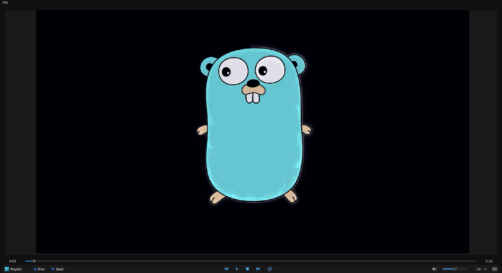

# Media Player
 

## Overview
This project is a fully functional media player built using **PyQt5**.
It supports multiple media formats, allows playlist management,
and provides essential playback controls such as play, pause, stop, next,
previous, and repeat.

## Features
- **Play/Pause/Stop** media files
- **Next/Previous** track navigation
- **Repeat mode** support
- **Playlist management**
- **Supports multiple file formats** including video and audio
- **User-friendly GUI** built with PyQt5

## Supported File Formats
This media player supports a wide range of audio and video formats, including:

- **Video**: `.mp4`, `.webm`, `.3gp`, `.mkv`, `.avi`, `.mov`, `.wmv`, `.flv`
- **Audio**: `.mp3`, `.wav`, `.wma`, `.flac`, `.3g2`, `.m4a`, `.m4v`, `.aac`,
    `.asf`, `.3gpp`
- **All Files**: Any file type can be opened using the `QFileDialog`

## Dependencies
To run this project, ensure you have the following Python libraries installed:

```sh
pip install PyQt5 PyQt5-sip PyQt5-Qt5
```

## Installation & Usage
1. Clone the repository:
   ```sh
   git clone https://github.com/yossefsabry/media_player
   cd media_player
   ```
2. Create and activate a virtual environment (optional but recommended):
   ```sh
   python -m venv venv
   source venv/bin/activate  # On Linux/macOS
   #venv\Scripts\activate     # On Windows
   ```
3. Install dependencies:
   ```sh
   pip install -r requirements.txt
   ```
4. Run the application:
   ```sh
   python3 main.py # on Linux/macOs
   #python main.py # on windows
   ```

## Creating an Executable (.exe)
To convert this project into a standalone executable, you can use **auto-py-to-exe**:
```sh
auto-py-to-exe
```
- Select **"One File"**
- Choose **"Console Window" (or "No Console" for GUI applications)**
- Click **"Convert .py to .exe"**
- The `.exe` file will be available in the `output` folder.


##  for convert icons
```bash
pyrcc5 icon_resource.qrc -o icon_resource.py
```


## for run MediaPlayer.py
```bash
./build
```
